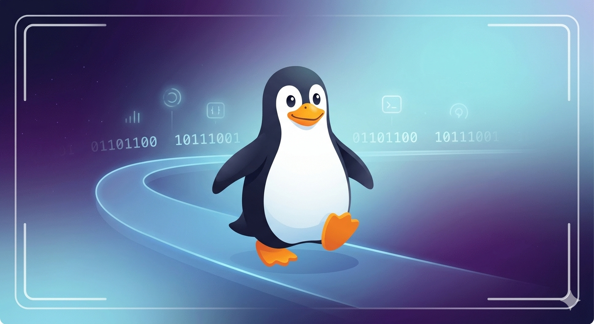

<h1 align="center">Linux Fundamentals</h1>

  

Hands-on lab documentation covering Linux fundamentals from 
the ground up. Every concept practiced on a live Amazon Linux 
2023 EC2 instance, documented publicly, and connected to how 
Linux is actually used in production cloud environments.

Linux is the operating system running underneath nearly every 
cloud server, container, and production workload in existence. 
Engineers who work in cloud infrastructure do not just run 
commands. They understand why the Linux filesystem is 
structured the way it is, what permissions actually protect, 
and how the terminal connects to every layer of the cloud 
engineering stack.

---

## What's Covered
- SSH configuration and remote server access
- Filesystem structure and hierarchy
- File viewing, creation, and management
- Text searching and command chaining
- File permissions and access control
- User and group administration
- Service management with systemctl
- Bash scripting and task automation
- Log analysis and system monitoring

---

## Labs & Documentation

| Title | Topic | Status |
|---|---|---|
| [Lab 01 — SSH into EC2 from Mac Terminal](labs/lab-01-ssh-into-ec2.md) | SSH, key pair authentication, AWS CLI verification | ✅ Complete |
| [Lab 02 — SSH Config File: Connecting to EC2 Made Easy](labs/lab-02-ssh-config-file.md) | SSH config file setup, hostname aliasing, permission hardening | ✅ Complete |
| [Doc 03 — File System Navigation](labs/doc-03-file-system-navigation.md) | Filesystem hierarchy, pwd, ls, cd, mkdir, rm, cp, mv, find, cat, touch, nano, grep, pipe operator | ✅ Complete |
| [Doc 04 — File Permissions, Ownership, and User Management](labs/doc-04-file-permissions-ownership-user-management.md) | chmod, chown, useradd, usermod, passwd, id, groups | ✅ Complete |
| [Doc 05 — Service Management](labs/doc-05-service-management.md) | systemctl, starting and stopping services | 🔨 In Progress |
| [Doc 06 — Nginx Web Server on EC2](labs/doc-06-nginx-web-server-on-ec2.md) | Package installation, service configuration, live deployment | 📋 Planned |
| [Doc 07 — Log Analysis](labs/doc-07-log-analysis.md) | tail, grep, awk, CloudWatch log basics | 📋 Planned |
| [Doc 08 — Bash Automation Script](labs/doc-08-bash-automation-script.md) | Writing and executing shell scripts on EC2 | 📋 Planned |

---

## Environment

Amazon Linux 2023 on AWS EC2 (t2.micro)  
Access method: SSH via local Mac terminal using key pair 
authentication and SSH config file aliasing
