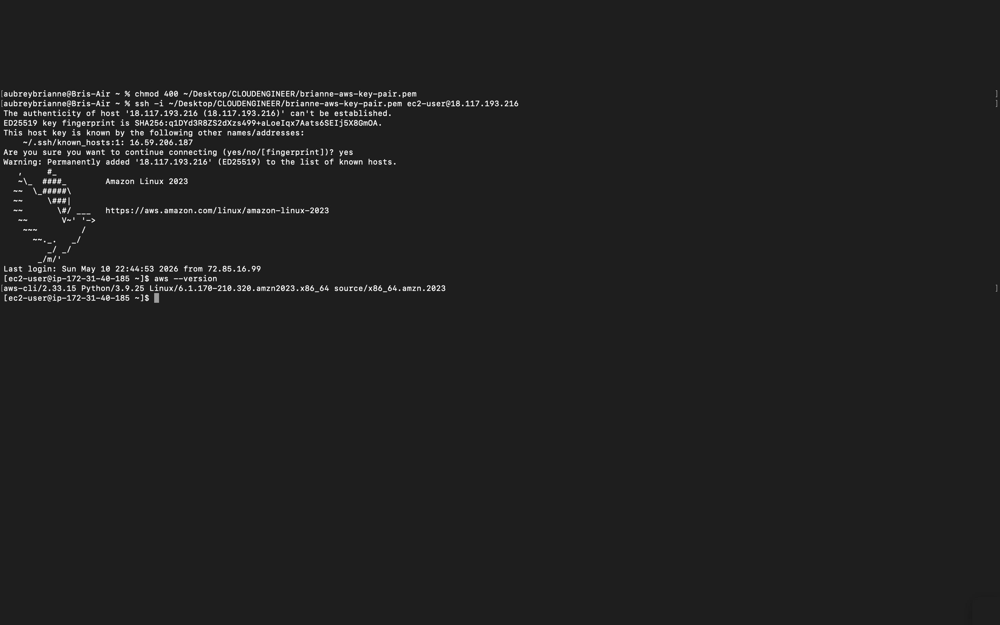

# Lab 01 — SSH into an EC2 Instance from Mac Terminal

## Overview
Connecting to a remote AWS EC2 Linux server from a Mac 
terminal using SSH and a .pem key pair. This is the 
standard method for accessing cloud infrastructure in 
professional environments.

## Prerequisites
- Active EC2 instance in running state on AWS
- .pem key pair file saved locally on your Mac
- Mac terminal or iTerm2

## Steps

**Step 1 — Set correct permissions on your .pem file**

    chmod 400 ~/Desktop/CLOUDENGINEER/brianne-aws-key-pair.pem

Only needs to be done once.

**Step 2 — Get your EC2 Public IP**

Go to AWS Console → EC2 → Instances → select your 
instance → copy the Public IPv4 address.

Note: This IP changes every time you stop and restart 
your instance. Always grab a fresh one before connecting.

**Step 3 — Connect via SSH**

    ssh -i ~/Desktop/CLOUDENGINEER/brianne-aws-key-pair.pem ec2-user@YOUR-PUBLIC-IP

**Step 4 — Authenticity Prompt**

The first time you connect to a new server you will see 
this message:

    The authenticity of host 'xx.xx.xx.xx' can't be established.
    Are you sure you want to continue connecting (yes/no)?

Type yes and press Enter. This is expected behavior the 
first time connecting to any new server. AWS is asking 
you to confirm you trust this host. After you confirm, 
the server is added to your known hosts file and this 
prompt never appears again for this instance.

**Step 5 — Confirm connection**

A successful connection displays the Amazon Linux 2023 
banner followed by this prompt:

    [ec2-user@ip-172-xx-xx-xx ~]$

You are now inside your EC2 instance and ready to 
execute commands remotely.

**Step 6 — Verify AWS CLI is installed**

    aws --version

You should see something like:

    aws-cli/2.33.15 Python/3.9.25 Linux/6.1.170

This confirms the AWS CLI is installed and ready 
to use on your instance.

**Step 7 — Disconnect when finished**

    exit

## Screenshot

## Key Observations
- Never share your .pem file or commit it to GitHub
- chmod 400 restricts the key so only you can read it — 
  SSH requires this as a security enforcement
- ec2-user is the default username for Amazon Linux instances
- The EC2 public IP is dynamic and changes on every restart
- The authenticity prompt on first connection is normal — 
  type yes to add the server to your known hosts file
- Every command typed after connecting executes on the 
  remote Linux server, not your local Mac
